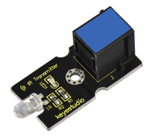
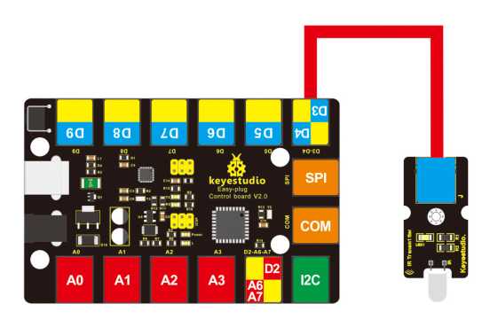

# KS0126 keyestudio EASY plug IR Transmitter Module



## 1. Introduction

An infrared transmitter is simply a Light Emitting Diode which generates IR light (invisible IR light).

In an infrared remote control, for example, pushing a button sends an electric signal to the LED, which converts the signal into a beam of infrared light. The receiving device detects the light with a photo diode and converts it to an electrical signal via an integrated circuit, thus control its actions.

Infrared transmitters are widely used as a means of wireless communication by remote controls for televisions and other electronic devices.

This IR transmitter module is designed for IR communication when paired with IR receiver module. 

This module should be used together with EASY plug control board.

**Special Note:**

The sensor/module is equipped with the RJ11 6P6C interface, compatible with our keyestudio EASY plug Control Board with RJ11 6P6C interface.

If you have the control board of other brands, it is also equipped with the RJ11 6P6C interface but has different internal line sequence, can’t be used compatibly with our sensor/module.

## 2. Specification

- Power Supply: 3-5V
- Infrared light wavelength: 940mm
- Infrared emitting angle: about 20 degrees
- Infrared emitting distance: about 1.3m
- Modulate Frequency: 38Khz
- Comes with a mounting hole
- High quality connector

## 3. Technical Details

- Dimensions: 44mm * 20mm * 18mm
- Weight: 4.5g

## 4. Connect It Up

Connect the EASY Plug Infrared transmitter sensor to control board using an RJ11 cable. Then connect the control board to your PC with a USB cable.



## 5. Upload the Code

Download Resource:  [Resource](./Resource)

Note： before uploading the code, you need to import the library files; otherwise, the code upload will fail.

```c
#include <IRremote.h>
IRsend irsend;

void setup()
{
	Serial.begin(9600);
}

void loop() 
{
    irsend.sendSony(0xa90, 12); // Sony TV power code
    delay(100);
}
```

